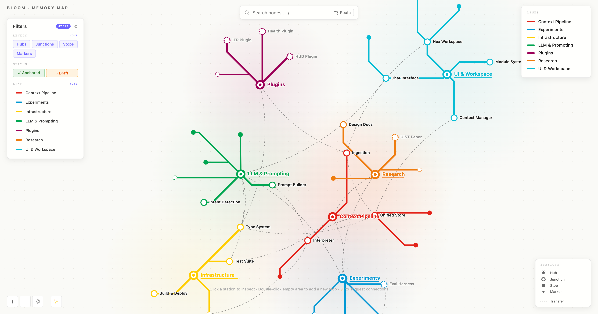

# cogmap

A metro-style map of your project that Claude Code keeps in sync.

```bash
npx cogmap init --name "My Project"
cd map-viewer && npm run dev
```

Then in Claude Code:

```
/update-map
```

Claude scans your project and populates the map. Vite hot-reloads. Your browser updates live.

---

## CLI

```bash
npx cogmap init [--name "Project Name"]   # scaffold a new map
npx cogmap upgrade                        # update an existing map to the latest version
npx cogmap version                        # print the installed version
```

**`init`** creates three things in your project root:

```
map-viewer/     Vite + React app — open this in your browser
map-engine/     MCP server — Claude Code connects to this automatically
.claude/
  commands/
    update-map.md    /update-map
    query-map.md     /query-map
    map-context.md   /map-context
```

It also writes the MCP server config to `.claude/settings.local.json` so Claude Code picks it up immediately — no manual setup.

**`upgrade`** re-syncs your `map-viewer/` and `map-engine/` with the latest scaffold, preserving `src/seed.ts` (your project's node data). Skills are always updated to the latest version.

---




---

Every concept, file, and connection in your project — laid out like a transit map. Hubs are lines. Ideas are stations. Cross-dependencies are transfer corridors.

Run `/update-map` and it rebuilds from your actual project state: README, directory tree, git history, memory files. No manual upkeep.

---

## What you get

**Map viewer** — Vite + React app with force-directed SVG layout. Search, filter, pathfinding, direct editing. Runs locally, no server.

**MCP engine** — SQLite-backed server with FTS5 search, BFS/DFS traversal, and a 4-layer context assembly system. Claude uses it to navigate the map programmatically.

**Slash commands** — `/update-map`, `/query-map`, `/map-context`. Drop them in `.claude/commands/`.

---

## The map vocabulary

| | Level | For |
|--|-------|-----|
| ◉ | Hub | Top-level pillars — 4 to 7 per project |
| ○ | Junction | Major sub-components |
| • | Stop | Specific concepts, files, features |
| · | Marker | Leaf-level detail |

Nodes are either **anchored** (stable) or **draft** (in progress). You can flip either way. Cross-edges connect things across hubs — dependencies, data flows, causal chains.

---

## Interactions

- `/` to search — ranked by relevance, pan and zoom on select
- Click a transfer line to edit its relationship type or delete it
- Double-click empty space to drop a new node
- Route button to find the shortest path between any two nodes
- Sparkle button to suggest connections from text similarity
- Filter by level, tier, or hub line

---

## Why

I've been in a research lab at NYU Tandon for two semesters working with Professor Vedant on work, Human-AI interaction, and wellness. The core question: how do you work *with* these models without becoming dependent on them?

Cogmap is one answer. A spatial, navigable view of your own project so you stay oriented — and so you're the one deciding what context the model sees, not the other way around.

The metro map metaphor came from actually riding the subway. You don't need to know every detail of the system. You just need to see the lines, the stops, and how to get from A to B.

---

This project wouldn't exist without [memPalace](https://github.com/MemPalace/mempalace). We were highly inspired by the work done by the team and wanted to expand on some of the underlying ideas.

Special Thanks to Prof Vedant Das Swain, Kevin and Sid for the ongoing discussions and research.
 


MIT
